# Gilbert Anthony Bernal MSDS-692 Data Science Project

## Overview
The data science project that was worked on for the Regis MSDS 692 practicum is titled "Establishment of Regis Healthcare Informatics Database". The goal of this project was to build a database for the Regis School of Health Informatics. The type of data that the school of health informatics uses is health data from various health organizations. These organizations provide data in various formats such as CSV, JSON, EXCEL, and more. The data format that is most commonly used by these organizations. Using PostgreSQL as the database management system and Python as a tool to upload the CSV files. A method was created in order to create a unique table based off a CSV file stored a directory in the PostgreSQL database, and upload the data in the CSV to the unique table created. An analysis on the effects of rainfall has on West Nile virus in California was done to provide an example of how this database and python code could be used. 

## Database Requirments & Goal
After talking to Dr. Judit Olah about the database needed for the program there were no clear requements. It was clear however that many indivudals could use this database for a variety of data from different sources that might not be used by anyone else but the person uploading it. This made the goal for the project to create a simple method for any one to use or update that would create a table based for each of the CSV files in a directory based its headers and then upload the data from the CSV file to its table. After that the files CSV files would have to be moved to an archive folder to make sure that the table does not get created more than once. 

## Tools

### PostgreSQL
PostgreSQL is a open source object-relational database system that uses the standard SQL language and extends the language with various features. The reasons why Postgres was chosen for this project over other database management systems was first the fact that Postgre was free and opensource. This means that there was absolutely no money needed in order to install and start using the database management system. The second reason was because Postgres works with a variety of data types. Examples of data types that Postgre works with are JSON, CSV, and XML. Making sure that the database chosen works well with various formats is important because the data the Health Informatics school will be using can vary based on the health organization they are getting their data from. The next reason is because Postgre works with various coding languages such as Python. Python has various libraries that can be used with PostgreSQL or manipulate data if needed before uploading the CSV data to the database. The last reason why PostgreSQL was chosen over other database is because it has a simple built in method COPY that allows users to upload CSV, JSON, and XML data files into its tables quickly.

### Python
Python is an open source high level programming language. The reason why Python was chosen for this project is that it has various libraries that work well with PostgreSQL and has other libraries that could help with the goals of the project.
### Python Libraries Used
Below are the Python libraries used for this project

**CSV:**
The CSV Library is used to allow python to work with CSV files. The reason why it was used in this code was simply to import any csv file needed. 

**AST:**
AST stands for abstract syntax trees and is a python library that is used to find out programmatically what the current grammar looks like. This package was used to look at the fields in the CSV file and identify the datatype that is stored in them. This helps with creating a CREATE TABLE PostgreSQL statement. The reason why this library is important is because if the CREATE TABLE statement does not have the correct data types for the column then the data cannot be uploaded. 

**PSYCOPG2:**
This library is the most popular PostgreSQL adaptor for Python. This package allows python to use PostgreSQL commands. The package was needed for the code in this project in order to create the table in the database for CSV files and to use the PostgreSQL COPY command to upload the data from the CSV files to their unique tables. 

**OS:**
The OS library is used to allow operating system functionality in python. This library is used to see all CSV files within a directory and begin running the created to create a table for these files and upload them to their unique table. 

**SHUTIL**
This library offers a number of high level operations for manipulating files. It can provide a way to copy, move, or remove files. This library was used to create a way to move CSV files from its main folder used for the python code to an archive folder so that multiple tables will not be created

### Tableau

Tableau is a powerful analytical tool that can be used for business intelligence. This tool was chosen over other analytical tools because of its ability to connect directly to databases, use SQL, and built in functions. 

# Part 1: Create the Database
Creating the database was the first step that had to be completed for the project. The reason is because a database was needed in order to test the CSV table creation and upload methods. Since no money was provided for this project open source database management systems were examined. After examining different open source databases, the one chosen was PostgreSQL. The reason why this one was chosen over other open source databases was because it uses the standard SQL language and has a command called COPY that can be used to upload CSV files directly into tables. Making sure that the database used the standard SQL language was important because many users know this language already. This makes it easy for users to work with the data that is being uploaded and understand the code used in python. The ability to upload CSV is important since these are the types of files used by many health care organizations. 

**Step 1: Download PostgreSQL**
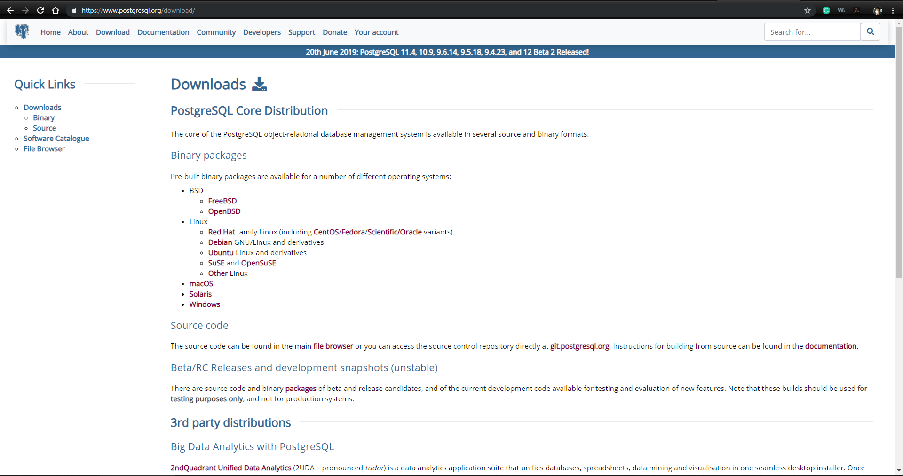

**Step 2: Follow Install Directions and Start Database**
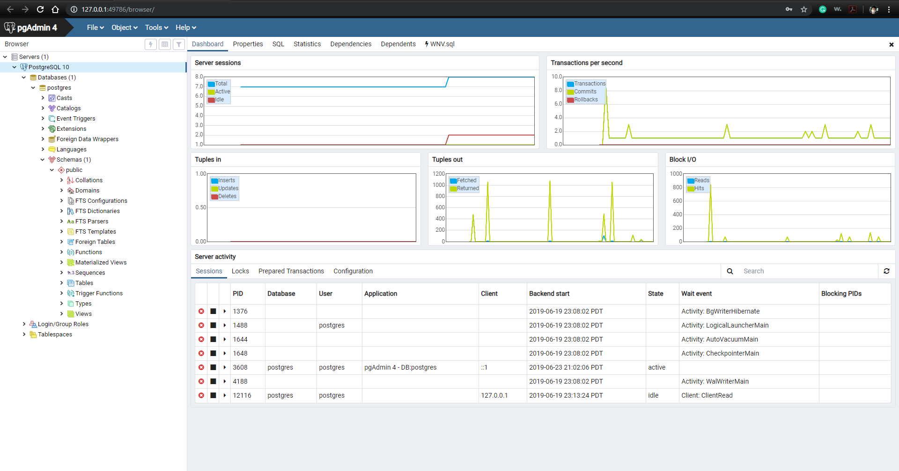

# Part 2: Create Python Code
Three Python codes were created for this project. These codes were Info.py, Import_Function.py and Import_CSV.py.

**Info.py:** This code is used to store login credentials of the PostgreSQL admin account as variables for any Python code using PostgreSQL to use. This user must be an admin so that it can use any of the database table commands with no issue.

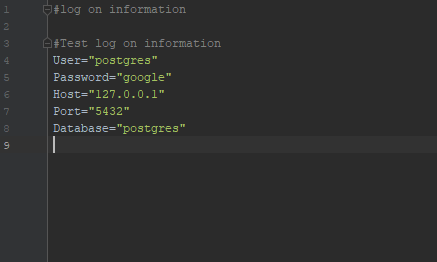

**Import_Function.py:** This code stores a function that is used to take any CSV file and create a table based on the headers and values stored in the CSV. After the CREATE TABLE statement is created the code then uses the variables in the Info.py file to connect to the PostgreSQL database and run the CREATE TABLE statement in order to create the unique table for the CSV. After that another connection is made and the COPY command is used to upload the data from the CSV used to create the table into it. 

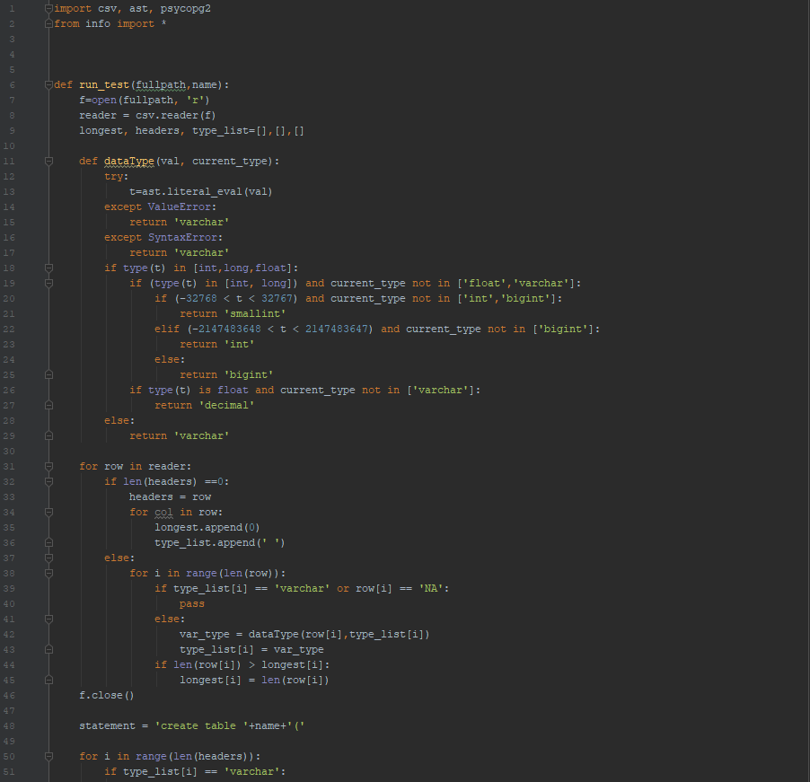

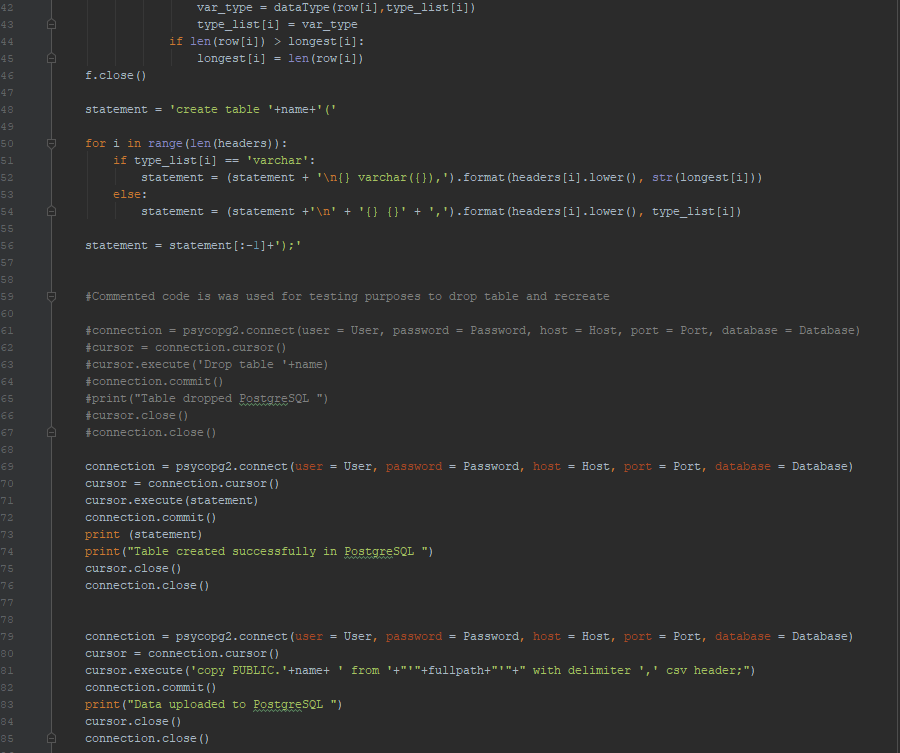

**Import_CSV.py:** This code is used to obtain the paths of the directory where the CSV files are stored and the archive directory that we want our files to move to after running the Import_function.py. After obtaining the paths the code then creates a function that will go through each of the files within a certain directory. After this a loop is used to go through all of the files in the directory and run the function created in the Import_Function.py to create the table and upload the data for every CSV file in the directory. After that the file is then moved to the archive folder to make sure that the table is not created again. 

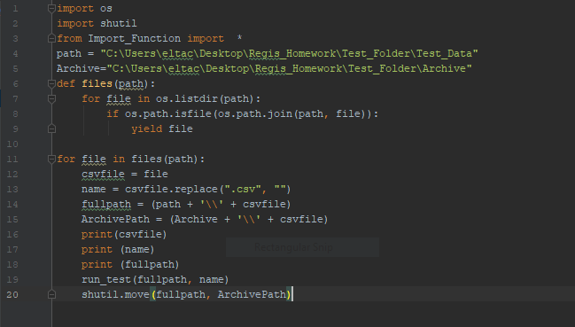

# Part 3: Run Analysis to Test Database & Code
## Background

To test the database and python code an analysis was done. The analysis looked to see if there was a correlation on the number of confirmed cases of the West Nile virus and the amount of rainfall in Los Angeles California using a regression model. Los Angles California was chosen because it is a major city within California with a large population that has had an increased number of Confirmed West Nile virus cases. The reason why West Nile virus was chosen for this project because it is the leading cause mosquito borne disease that occurs in the United States (“West Nile Virus”, 2018). West Nile s spread by the Culex mosquito species and starts during mosquito season (summer through fall). There is no vaccines to prevent or medications treat it. Those that do get infected with West Nile might feel sick and develop a fever. It is only 1 out of 150 that do develop serious symptoms such as fever or death. The only way to prevent being bit by a mosquito that might have West Nile virus is by wearing mosquito repellent, wearing clothing to prevent bites, stay away from areas with stagnant water, take preventative measures to reduce the number of mosquitos at home. 

The paper “Effects of rainfall on Culex mosquito population dynamics” by Lucas Valdez looks at how rainfall effects the population of the Culex mosquitos. This paper starts by mentioning that mosquito populations rely heavily climatic variables such as temperature and precipitation (Valdez, 2018). It then goes on to mention how Culex mosquitos are becoming an increasing health treat because of their ability to transfer illnesses such as the West Nile virus and St. Louis encephalitis virus to humans and domestic animals. Rainfall is one of the important climate factors when it comes to the mosquito population. This is the amount of rainfall determine the production and size of the mosquito breeding sites.  This paper used a dynamic model on the mosquito population that incorporates the effect of rainfall. The data used for the model in this paper was climate data from Cordoba city between the years 2008 and 2009 and used a compartmental ordinary differential equation model for mosquito abundance. From the results in the model it was seen that with rainfall there was an increase in the abundance of the mosquito population to some extent. The amount of rainfall and intensity of it effected the mosquito population differently. This is because the amount of rain over a period promotes breeding sites for mosquitos. If there is little rainfall with low precipitation, then the breeding sites tend to evaporate quickly. If rainfall was distributed over a few days then the mosquito population would increase. However if there it were to increase beyond a specific point then the rain becomes to thin to maintain breeding sites (Valdez, 2018).  In general, this paper identified that rainfall has a strong effect on the population of Culex mosquitos.

## Overview

For this project data was obtained from two different sources. The first source was from HealthData.gov and data collected was on confirmed West Nile virus cases in different cities within California. The next source was from Los Angeles Almanac and the data collected form this source was on the total rainfall in Los Angeles recorded from the USC downtown campus. Once these sources were collected the CSV files were checked to make sure no issues would occur when the python script mention in part two was ran for to create the files needed for the analysis. The issues identified within the CSV files were in the headers. The headers had spaces in them which can cause a common issue when creating a table. To correct this the columns were renamed to make sure this issue would no occur. After that the files were renamed to use my username (gbernal) and then the name of the file. This way they would be easy to identify and remember. Once this was done the python files were ran to create the table and upload the data to the unique table created. After this was done a Tableau report was created to create the regression model, calculate the correlation and R squared values, and visually see if there was a correlation between the two. After doing this the results showed that there was no correlation between the amount of rainfall and confirmed cases of West Nile virus in Los Angeles California. 

**Step 1: Obtain Data**

West Nile Virus Source

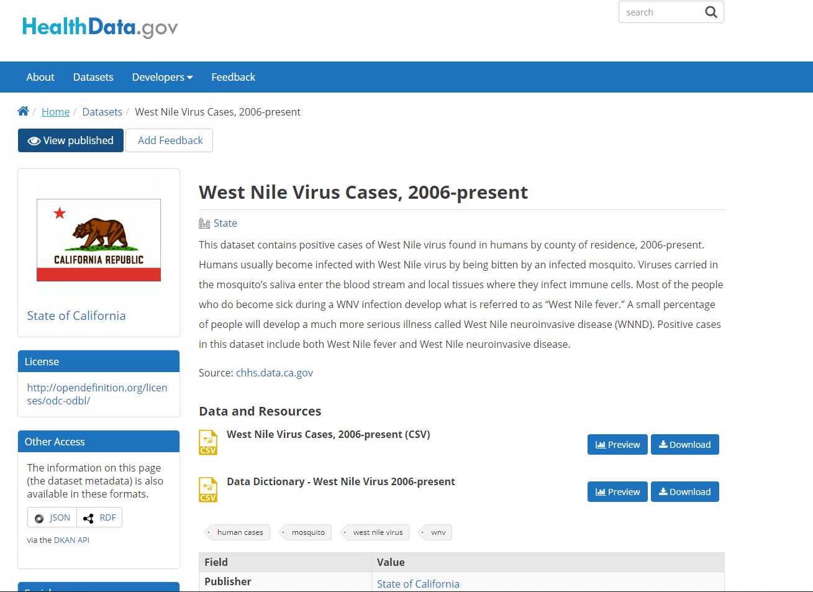

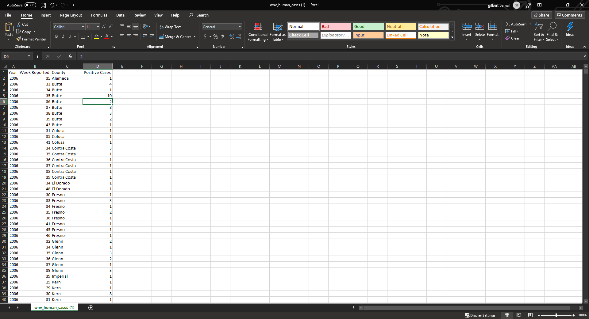

LA Rainfall Source

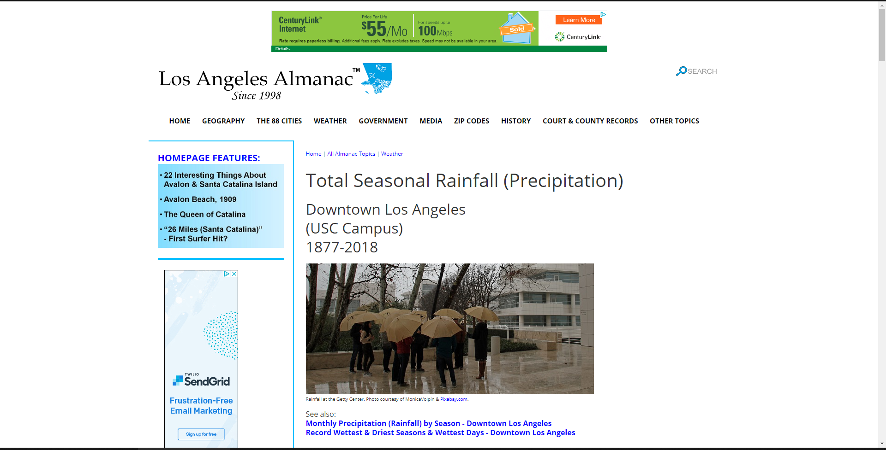

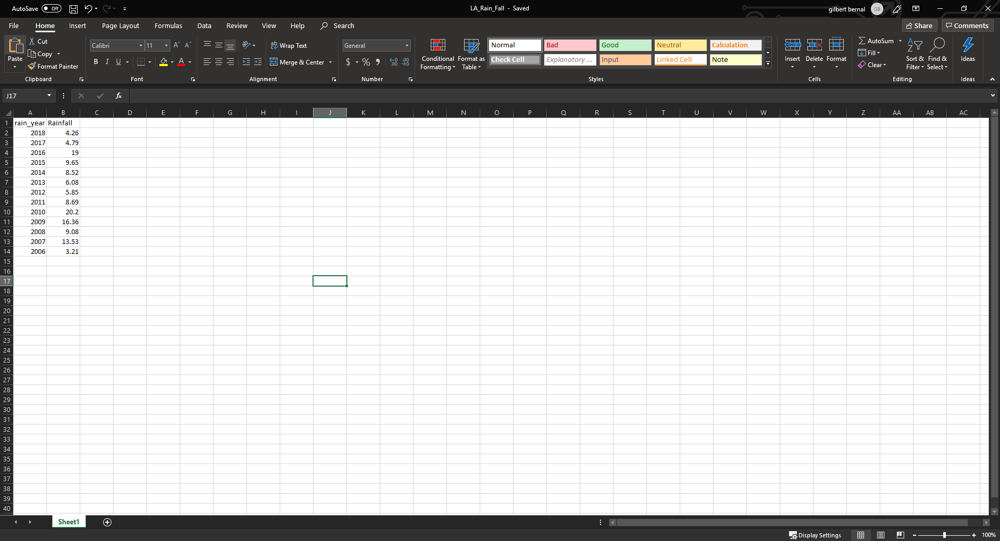

**Step 2: Clean Data and Rename files**

Two columns were seen to possibly cause an issue with the WNV excel data. Two of the columns had a space in the header. The Week Report column was removed since we are going to be doing this analysis by year and the Positive Cases columns was replaced with Postitive_Cases. 

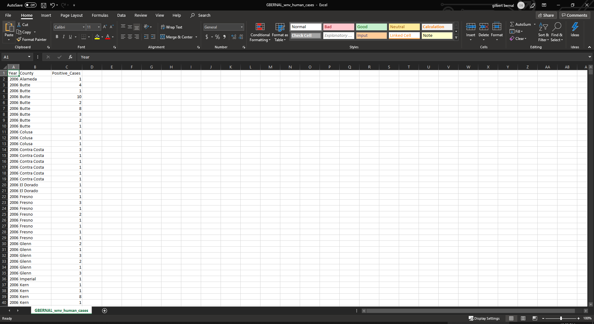

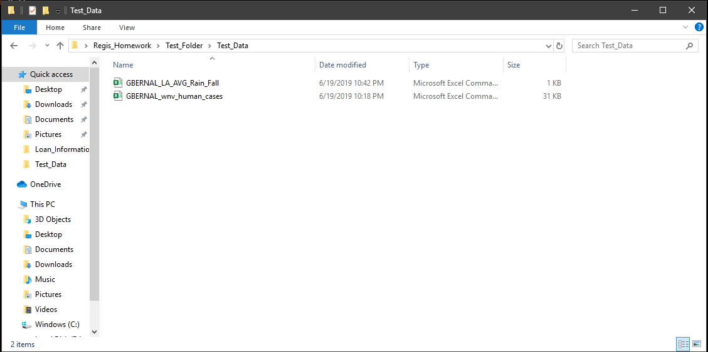

**Step 3: Run Python Import_CSV.py code**

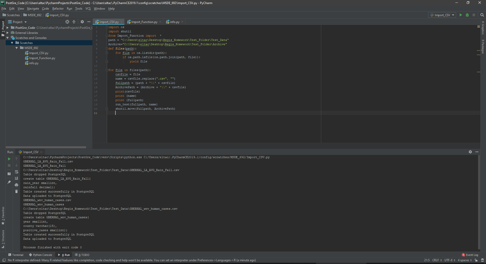

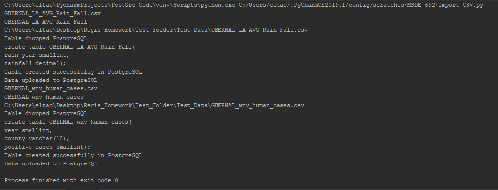

**Step 4: Create Query**

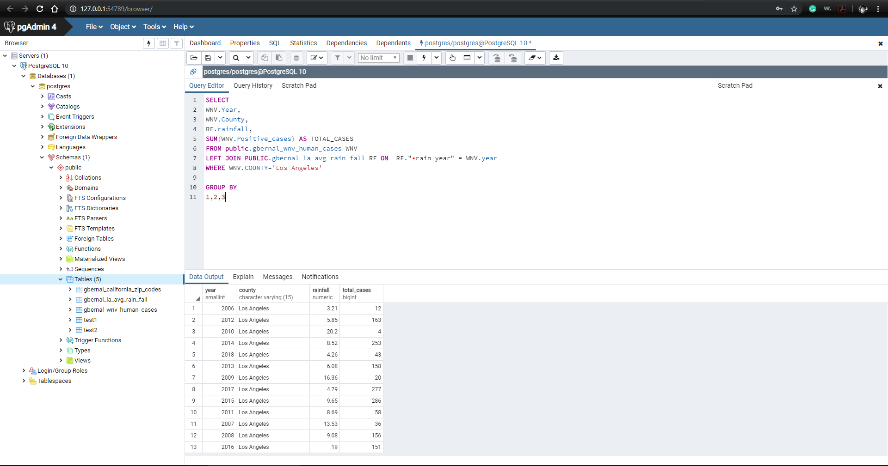

**Step 5: Import Data into Tableau**

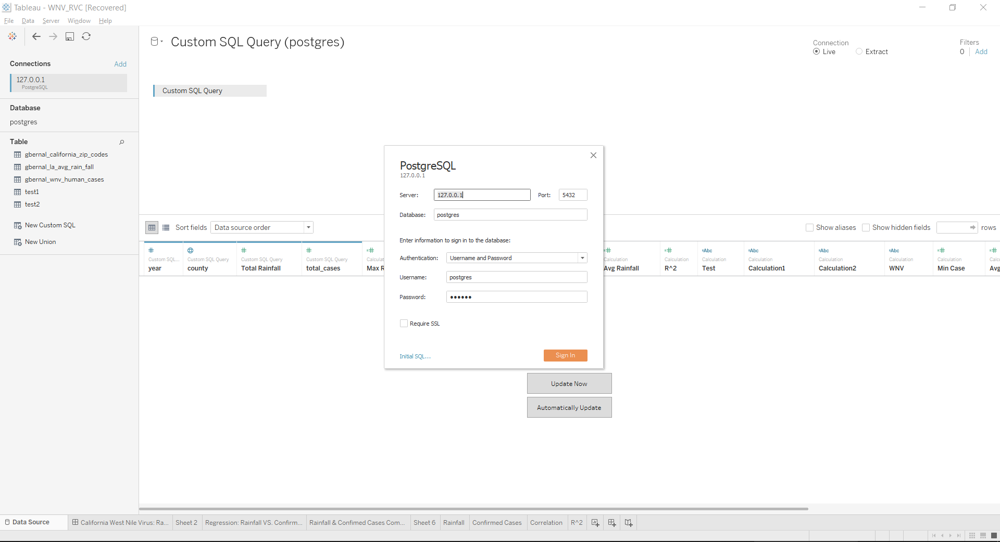

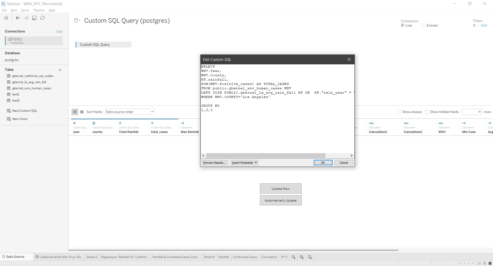

**Step 6: Create Report**

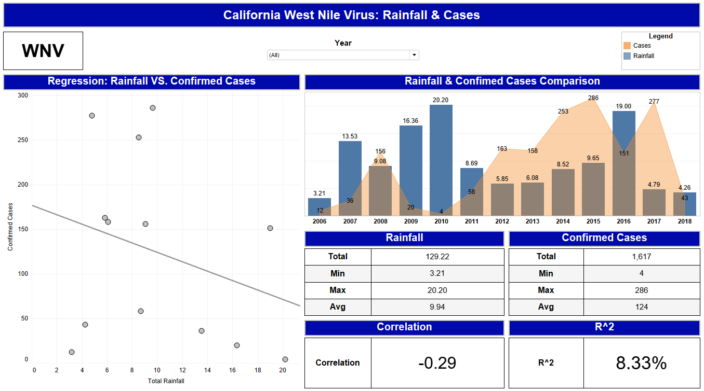

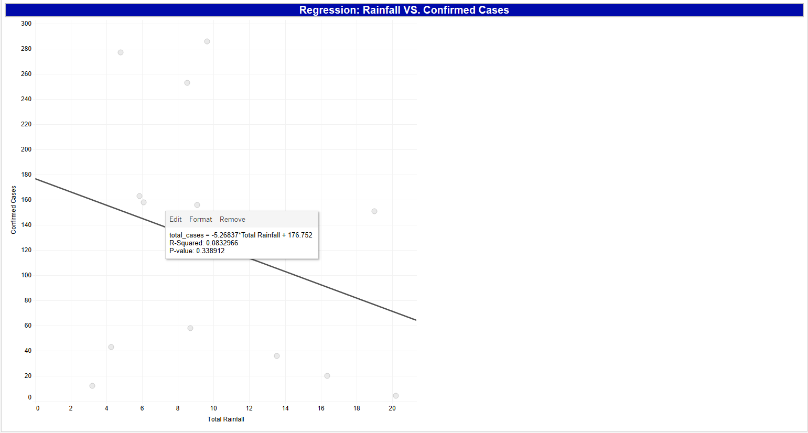

# Results
When looking at the regression model created by Tableau its easy to see that our model line is not a good fit for the data used. This shows that there is no correlation between rainfall and number of confirmed cases. To check and make sure that spear man’s correlation and the R squared value were calculated. Our correlation value was at -.29 and our R-square value was at 8% . Both of these values show a weak correlation between rainfall and confirmed cases of West Nile virus. These results could be affected by the amount of data used or by the fact that the rainfall data was from a single area within LA. 

# Conclusion
Tools used and code created successfully worked as planned with no issues. The most important function COPY for the data ingestion worked as expected. The Python code also worked as expected. It created the tables based off the headers and made the correct choice for each of the column data types in the CSV file. It also uploaded the data to their unique tables with no issues. Tableau was also able to connect to the database with easy, use the query created, and created the report as needed. Overall the project was a success. 

# What’s next?

### Possible Project Ideas

* Add this project to Regis servers and add API
  * API would allow users to upload their CSV files to a directory for python codes to run and create their data tables
* Add data governance
  * Data governance would need to added to this database.
   * If not the database will get extremely messy and ill have a large amount of data stored in it that isn’t being used
* Update Import_Function.py to use other data formats
  * Make it so that the funciton can import any file regardless of its format

# References 

The World's Most Advanced Open Source Relational Database. (n.d.). Retrieved June 26, 2019, from https://www.postgresql.org/

Total Seasonal Rainfall (Precipitation). (n.d.). Retrieved June 26, 2019, from http://www.laalmanac.com/weather/we13.php

Valdez, L. (2018, October 10). Effects of rainfall on Culex mosquito population dynamics. Retrieved June 26, 2019, from https://arxiv.org/pdf/1703.08915.pdf

Welcome to Python.org. (n.d.). Retrieved June 26, 2019, from https://www.python.org/

West Nile virus. (2018, December 10). Retrieved June 26, 2019, from https://www.cdc.gov/westnile/index.html

West Nile Virus Cases, 2006-present. (2019, June 25). Retrieved June 26, 2019, from https://healthdata.gov/dataset/west-nile-virus-cases-2006-present
